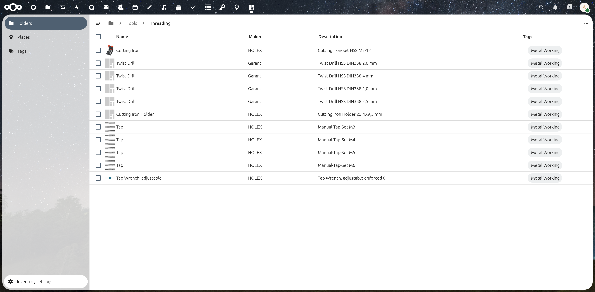

# Inventory

[](https://gitlab.rschluessler.com/raimund.schluessler/Inventory/commits/master) [](https://gitlab.rschluessler.com/raimund.schluessler/Inventory/commits/master)

**An inventory app for [Nextcloud](http://nextcloud.com). Manage your inventory.**



## Features

* edit items

## Developer setup info

Just clone this repo into your apps directory (Nextcloud server installation needed). Additionally,  [nodejs and npm](https://nodejs.org/en/download/package-manager/) are needed for installing JavaScript dependencies.

Once node and npm are installed, PHP and JavaScript dependencies can be installed by running
```bash
$ make
```
Please execute this command with your ordinary user account and neither root nor sudo.
